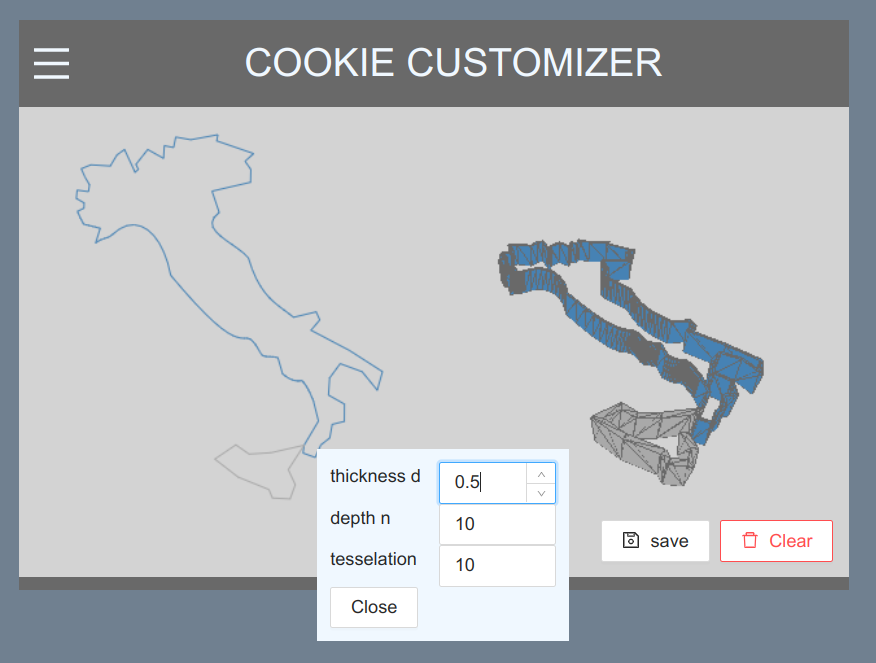

# Custom Cookies

Quickly convert simple SVG images into printable cookie cutters

Find a ready to use version here: <https://mjleehh.github.io/customcookies/>



**Warning: This is an early prototype and a toy project!**

This small toy app converts all paths in an SVG file into printable cookie cutter geometry.

Load an SVG file, chose your tessellation level and the desired overall thickness of 
the cooke cutter. On save the tool generates an OBJ file which can be imported into
most commonly used slicers.

**Warning**: most 3D printing materials are **NOT** suitable for food use!


## Usage

Prerequisites: 
- make sure you have an up-to-date NodeJS and NPM installed.
- an up-to-date browser (there is no acceptable reason for using outdated browser versions)

This tool comes as a web app. To use the most recent version you can bundle it yourself.
Otherwise just use the link at the start of this document to find a ready to use version online.

1. clone this repo
2. navigate a command prompt to the repo location
```shell
cd <repo-location>
```
3. fetch dependencies
```shell
npm install
```
4. run a development version of the app
```shell
npm start
```
5. using your favourite browser navigate to `http://localhost:3000`
